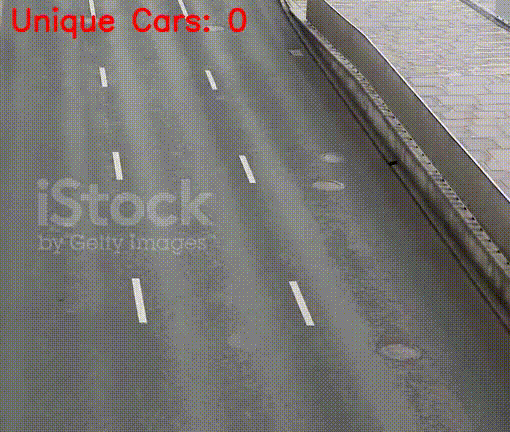

# Система отслеживания уникальных автомобилей



## 📖 Обзор

**Система отслеживания уникальных автомобилей** — это проект, предназначенный для мониторинга и отслеживания уникальных транспортных средств, отображения их траектории и подсчета количества уникальных автомобилей, попавших в кадр.

## ✨ Возможности

- Отображение проезда каждого уникального автомобиля.
- Поиск и идентификация автомобилей.
- Подсчет количества уникальных автомобилей, попавших в кадр.

## 🚀 Установка

1. Клонируйте репозиторий:
   ```bash
   git clone https://github.com/Lexeler/unique-car-tracking-system
   ```
2. Перейдите в директорию проекта:
   ```bash
   cd unique-car-tracking-system
   ```
3. Установите зависимости:
   ```bash
   pip install -r requirements.txt
   ```
4. Запустите приложение:
   ```bash
   python car_detection.py путь_к_видео.mp4
   ```
   ##
